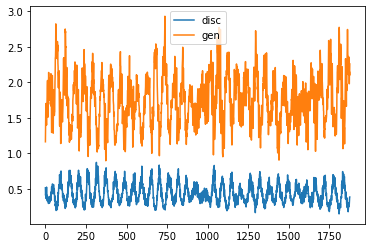
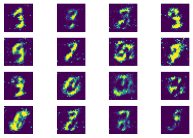
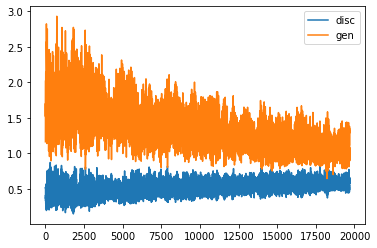
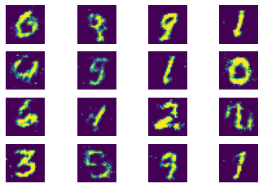
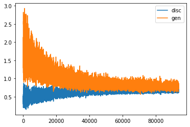
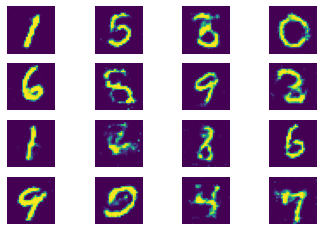

# GAN_pytorch

## Reference Paper

**Generative Adversarial Nets** 

[Link to Paper](https://arxiv.org/pdf/1406.2661.pdf)

---

## References : 

The network architecture, and choice of activations and regularization units is inspired from different implementations available on web

For generator, leaky relu activations for all layers except the final output layer is used. Output layer has Tanh activation. 

For discriminator, leaky rely activations and dropout layer is used for all the layers except output layer. Output layer uses Sigmoid activation. 

--- 

## Training Data

MNIST train Dataset is used for training. 

--- 

## Network Details

GAN - Generative adversarial networks are implicit density type of generative models. The focus here is not to explicitly model the data distribution, but to sample from the data distribution directly. 

Few examples of explicit density models are [MADE](https://github.com/pranayKD/MADE_pytorch) and [pixelCNN](https://github.com/pranayKD/basic_pixel_cnn_pytorch)

GAN consists of Generator and Discriminator models. Both these models are pitted against each other. 

* Generator Network
  * Generator network tries to take data points from latent space and tries to create an image

* Discriminator Network
  * Discriminator network has only task to classify real image from fake image. Fake image is the one that is created by generator network. 

----
## Training Loss and Generated Images

* Epoch 1

   
   

---
* Epoch 20

   
   

---

* Epoch 100

   
   

---

----
